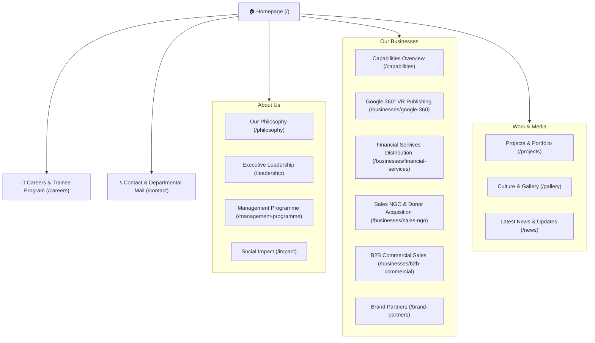

# Executive Client Guide & Platform Overview

**Prepared For:** Eros Inc. Leadership & Board  
**Document Type:** Executive Client Overview & Sitemap Blueprint  
**Version:** 2.0 (Official Production Handover)  

---

## 1. Executive Introduction & Brand Vision

Welcome to the new digital flagship platform for **Eros Inc.** 

Designed with modern corporate elegance and built for high conversion, this platform positions Eros Inc. as an industry leader in **Omnichannel Sales Execution**, **Multi-Channel Brand Activation**, and **Strategic Customer Acquisition**.

### 🌟 Core Design Principles:
* **Compete With Compassion:** The site highlights Eros Inc.’s unique brand ethos—balancing high-performance sales scaling with ethical integrity and human connection.
* **Instant Visual Impact:** Features dynamic 3D ambient visual effects, curated color palettes, and glassmorphism styling that wows clients and partners on arrival.
* **100% Mobile & Tablet Optimization:** Every page seamlessly adapts to smartphones, tablets, laptops, and 4K displays.
* **Zero Technical Friction:** Designed so your non-technical team can effortlessly publish news updates, post achievements, and upload gallery media without writing a single line of code.

---

## 2. Complete Site Map & Navigation Blueprint

The platform architecture is structured into **4 sleek dropdown categories**, giving visitors instant access to all pages while keeping the top header clean and uncluttered.

---

## 3. Comprehensive Feature & Functionality Breakdown

### 🏠 1. Homepage (`/`)
The front door to Eros Inc., crafted to immediately build trust and drive corporate partnership inquiries.
* **Hero Experience:** High-impact banner featuring subtle 3D background animation and core message (*"Ethical Sales Scale. Compete With Compassion."*).
* **Live Metric Cards:** Highlights 4 core organizational statistics:
  * `50+ Dedicated Team Members`
  * `100% Internal Promotion`
  * `4+ Core Industry Sectors`
  * `100% Direct Customer Reach`
* **Core Business Divisions Showcase:** Interactive cards highlighting Google 360°, Financial Services, Sales NGO, and B2B Commercial Sales with direct links to catalogue details.
* **Practical Training Banner:** Highlights the 30-day foundation program (*"Learn. Work. Grow."*) and certified trainee achievements.
* **Widescreen Gallery Preview:** A curated 6-photo preview of authentic team moments and workshops.
* **Latest News Feed:** Automatically pulls the 3 most recently published articles from your news hub.

---

### 💡 2. About Us & Company Culture

#### **Our Philosophy (`/philosophy`)**
* Explains Eros Inc.’s core mission: *"Driven by innovation, data-backed insights, and a customer-first approach."*
* Features 3 core pillars: *Purpose & Story*, *Innovation & Insights*, and *Lasting Success*.
* Embedded high-definition team photograph showcasing operational strength.

#### **Executive Leadership (`/leadership`)**
* Details Eros Inc.’s merit-based promotion model from *Business Associate* up to *Business Head*.
* Showcases executive team portraits with top-aligned framing so faces are clearly visible on all devices.

#### **Social Impact (`/impact`)**
* Highlights community initiatives, fundraising campaigns, and non-profit partner outreach.

---

### 💼 3. Business Catalogues & Capabilities

#### **Capabilities Overview (`/capabilities`)**
* Comprehensive overview of Eros Inc.’s 4 operational pillars and 5-stage career progression pathway.

#### **Dedicated Business Catalogue Pages:**
1. **Google 360° Property Publishing (`/businesses/google-360`):** HDR 360° virtual tours, Google Street View integration, and local search visibility.
2. **Financial Services Distribution (`/businesses/financial-services`):** Retail banking growth, credit card customer onboarding, and verified KYC compliance.
3. **Sales NGO & Donor Acquisition (`/businesses/sales-ngo`):** Sustainable donor pipelines and outreach campaigns for global non-profits.
4. **B2B Commercial Sales (`/businesses/b2b-commercial`):** Enterprise account acceleration, corporate B2B sales negotiation, and channel partner expansion.

#### **Brand Partners (`/brand-partners`)**
* Highlights corporate partner alliances across Entertainment, Financial Services, VR Tech, and Social Causes.

---

### 🎓 4. Practical Management Programme (`/management-programme`)

* **Curriculum Breakdown:** *"Learn. Work. Grow."* details the 30-Day Foundation Program covering Smart Selling, Business Communication, Market Analysis, Confidence Building, and Public Speaking.
* **Our Certified Achievers Grid:** Displays official certificate photos (*Foundation Completion, Appreciation, Excellence, Leadership Advancement, Team Building*) arranged in a centered, symmetrical presentation layout.

---

### 🎨 5. Projects & Culture Gallery

#### **Projects & Portfolio (`/projects`)**
* Real-world campaign case studies across Bollywood Movie Promotions, Financial Services Growth, Google 360 Capture, and NGO Donor Onboarding.

#### **Culture & Media Gallery (`/gallery`)**
* Authentic photo library featuring team workshops, award celebrations, and international networking meets.
* **Smart Auto-Sync:** Any photo attached to a new news article in the CMS automatically appears inside the main Gallery grid.

---

### 📞 6. Contact & Multi-Departmental Mail Routing (`/contact`)

* **Interactive Google Maps Embed:** Direct location map of the corporate head office at *Wardhaman Industrial Estate, Thane West, Maharashtra*.
* **Departmental Inquiry Selector:** Contact form automatically routes messages to specific internal email addresses:
  * General Inquiries: `contact@erosinc.in`
  * Business Partnerships: `partnership@erosinc.in`
  * Careers & HR: `hr@erosinc.in`
  * Training & Management: `hello@erosinc.in`
  * Information: `info@erosinc.in`
  * Support: `support@erosinc.in`
* **Floating WhatsApp Action:** Fixed widget at the bottom right linking directly to WhatsApp (`+91 93244 83283`).

---

## 4. How Non-Technical Team Members Manage Content

Managing updates on the site is as easy as typing an email!

### 📝 Publishing News & Media in 4 Simple Steps:

1. **Log in:** Go to `https://erosinc.in/admin` and click **Log in with GitHub**.
2. **Click Create:** Click **News & Updates** $\rightarrow$ **New News & Updates**.
3. **Add Content:** Type your title, pick a date, write your story, and select or upload a image.
4. **Hit Publish:** Click **Publish**. Within **30 seconds**, your article (and image) automatically appears live on the Homepage, News Hub, and Gallery!

---

## 5. Security, Speed & Reliability Guarantees

* **SSL Security:** Includes automatic 256-bit SSL encryption (HTTPS) with zero maintenance required.
* **Global Speed CDN:** Hosted on Vercel's global edge network, guaranteeing loading speeds under 1 second anywhere in India or abroad.
* **Zero Host Cost (Free Tier):** Operating costs are completely covered under free tiers with zero monthly hosting bills for standard traffic.
